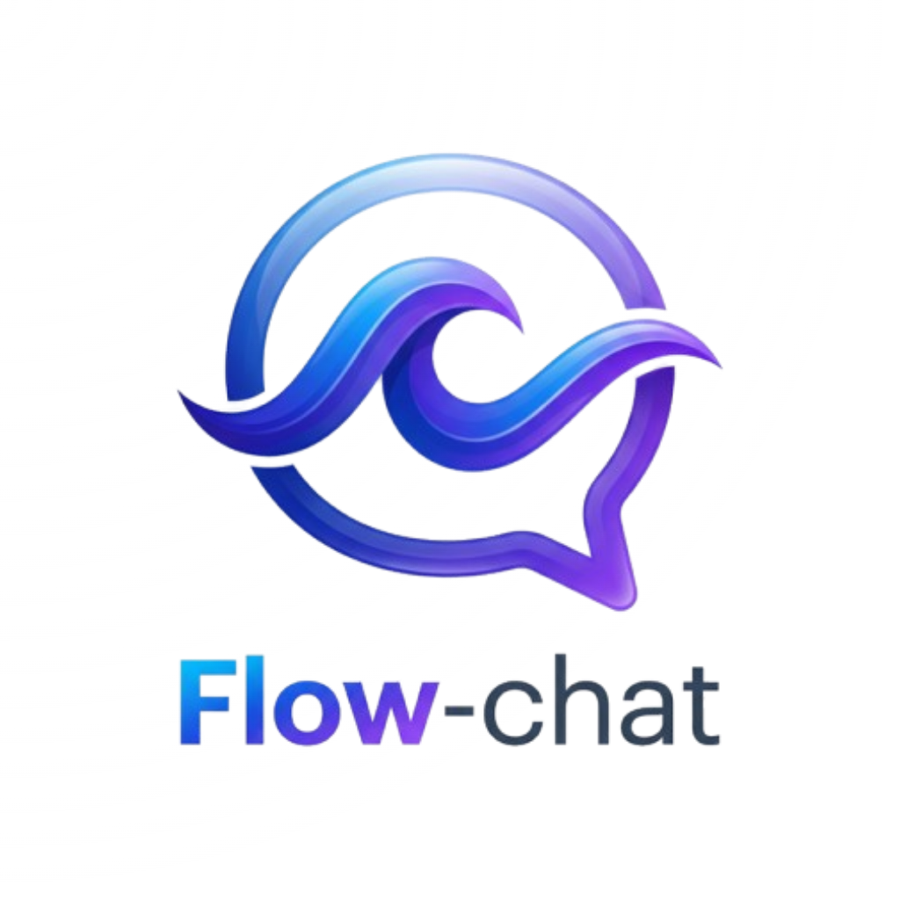
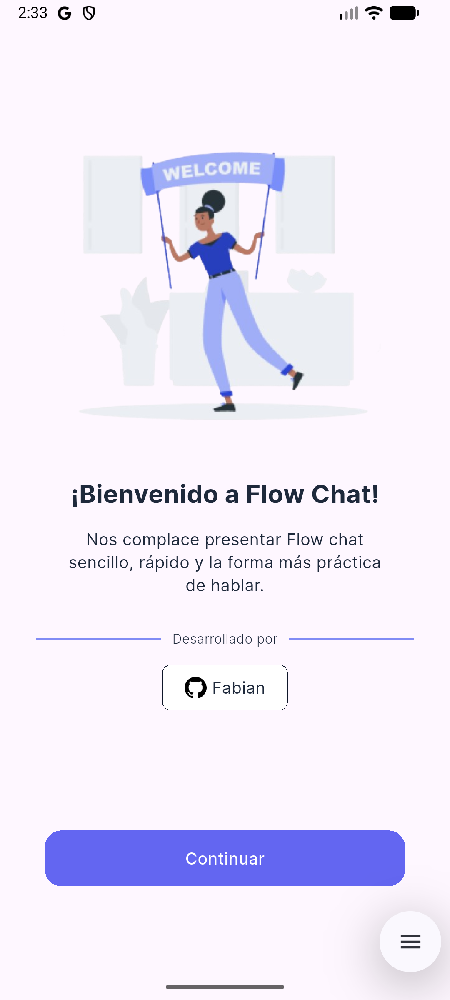
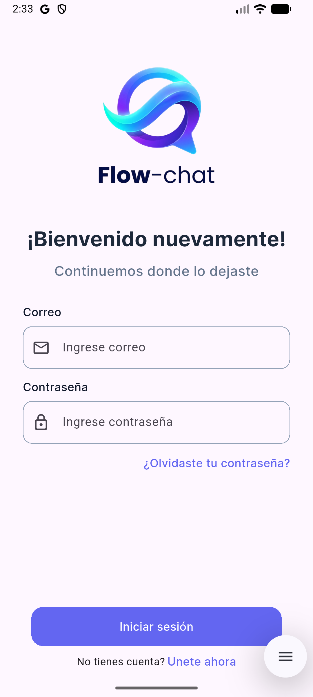
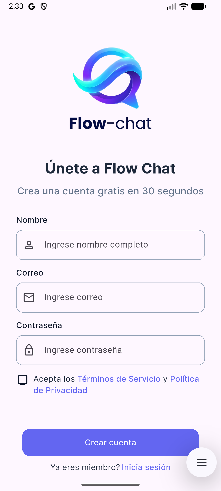
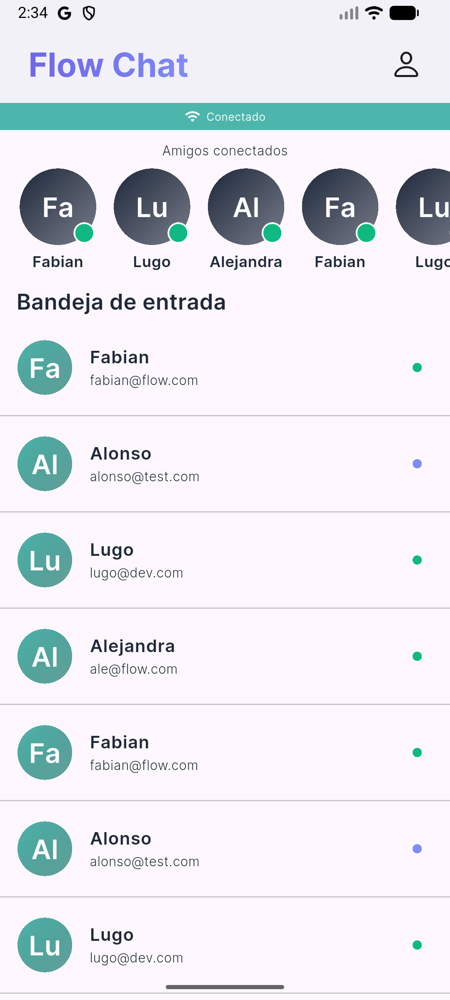
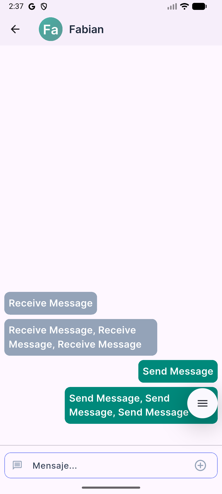

# Flow-chat

<p align="center">
  
</p>

<p align="center">
  <b>Chat en tiempo real con Flutter: REST, sesión segura y WebSockets.</b>
</p>

---

<p align="center">
  
  
  
  
</p>

## Rediseño visual (V2)

La identidad de **Flow-chat** apuesta por una estética moderna y un sistema de tokens para colores y tipografía.

| Nuevo logo | Concepto |
| :---: | :--- |
|  | **Identidad dinámica**: burbuja de chat minimalista y ondas que representan el flujo de la conversación. |

---

## Capturas y flujo

Para usar tus propias imágenes, colócalas en `assets/screenshots/` o ajusta las rutas en las tablas siguientes.

<div align="center">

| Bienvenida | Login | Registro |
| :---: | :---: | :---: |
|  |  |  |

| Bandeja de entrada | Chat |
| :---: | :---: |
|  |  |

</div>

---

## Sobre el proyecto

**Flow-chat** es un cliente móvil (Flutter) para un backend de chat (API REST + MongoDB y canal en tiempo real vía **Socket.IO**). El renderizado de la UI y la organización del código priorizan claridad y evolución por features.

### Pilares
- **Fluidez**: transiciones y listas con buen rendimiento.
- **Seguridad**: token almacenado con `flutter_secure_storage` y cabecera `x-token` en peticiones.
- **Tiempo real**: conexión WebSocket con el mismo `baseUrl` que la API, autenticada con el token.
- **Diseño**: `AppColors`, `AppTextStyle` y componentes reutilizables.

---

## Características principales

- **Mensajería**: historial por conversación (REST) y conexión en tiempo real (Socket.IO).
- **Autenticación**: registro, inicio de sesión y comprobación de sesión (refresh) contra la API.
- **Estado global**: `provider` con `AuthService`, `SocketService` y `MessagesService`.
- **Navegación**: `go_router` — pantalla de carga inicial, bienvenida, login, registro, bandeja anidada con chat y perfil (ver [ARCHITECTURE.md](ARCHITECTURE.md)).
- **Estructura por features**: `lib/features/<auth|chat>/` (presentación, widgets, servicios).

---

## Estructura del código

La app se organiza por **funcionalidad** (auth, chat) y módulos transversales (`api`, `services`, `theme`, `models`, `router`). El detalle de carpetas, flujo de datos y convenciones está en **[ARCHITECTURE.md](ARCHITECTURE.md)**.

---

## Configuración del backend

La URL base del API y del socket se define en `lib/api/api_config.dart` (implementación de `ApiConfig`). Ajusta `baseUrl` al host donde expongas tu API antes de generar un build que vaya a dispositivos o tiendas.

Endpoints relativos: ver `lib/api/api_endpoints.dart` (`/auth/signin`, `/auth/signup`, `/auth/refresh`, `/user/list`, `/messages/:userId`).

---

## Icono de la app

1. Sustituye `assets/icons/app_icon.png` por tu recurso.
2. Verifica en `pubspec.yaml` el bloque `icons_launcher` (el proyecto usa el paquete **icons_launcher**).
3. En la raíz del proyecto:

```bash
flutter pub get
dart run icons_launcher:create
```

---

## Instalación

1. **Clonar** el repositorio.
2. **Dependencias:** `flutter pub get`
3. **Ajustar** `lib/api/api_config.dart` a tu API.
4. **Ejecutar:** `flutter run`

---

<p align="center">
  Desarrollado con ❤️ por <b>Victor</b> | 2026
</p>
